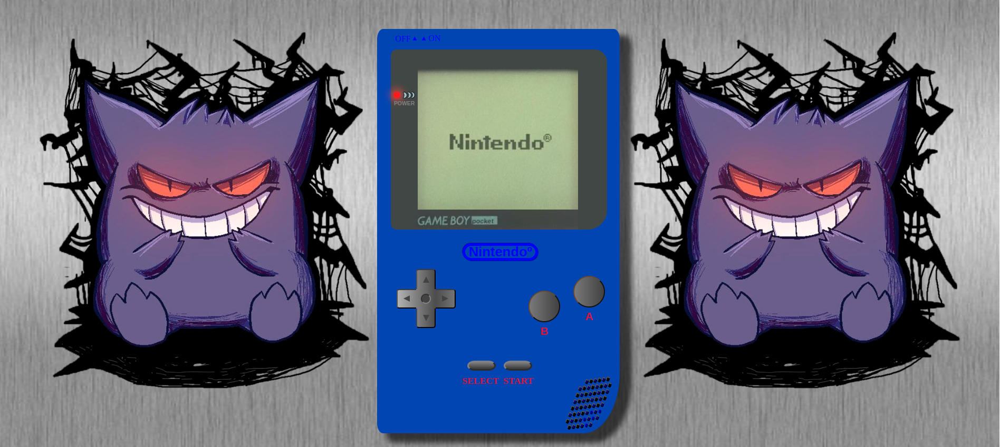
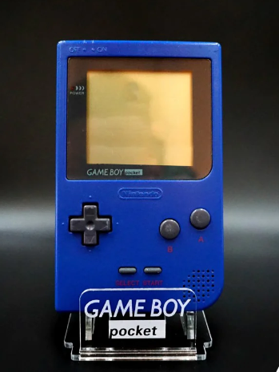
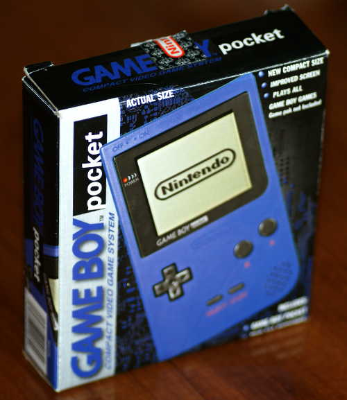
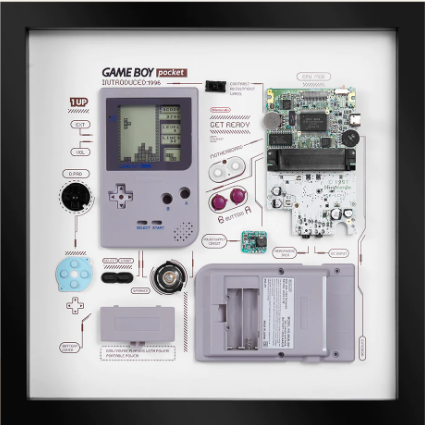
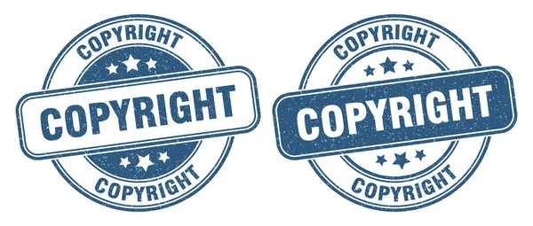

##### Proyecto 1 - Replica Videoconsola con css.

#Contenido:

- [Descripción del proyecto 📋](#Descripción-del-proyecto)
- [Acerca de 🎮](#Acerca-de:)
- [Desarrollo 🖥️](#Desarrollo)
- [Estado del proyecto 🚧](#Estado-del-proyecto)
- [Repositorio GitHub 💾](#Repositorio-GitHub)
- [Licencia y Copyright 📜](#Licencia)

### Descipción del proyecto

##### Este proyecto se basa en una réplica de la GameBoy Pocket utilizando Visual Studio Code.

### Acerca de

#### La GameBoy Pocket fué fabricada por Nintendo y lanzada al mercado en 1996 en Japón y EEUU y en 1997 en Europa. Este modelo es una modificación de la Game Boy clásica. Comparada con el modelo clásico, la Pocket tenía un tamaño mucho más pequeño.

### Desarrollo

####  Para este proyecto se ha utilizado HTML y CSS, también contiene imágenes descargadas de internet. 
#### El cuerpo de la consola esta dividido en 3 secciones (arriba, centro y abajo) para asi dividir los elementos principales entre la pantalla y las zonas de botones. Para el altavoz he usado un display grid.
#### Todos los botones son funcionales y estan preparados para añadirles acciones a cada uno como animaciones o funcionalidades para interactuar con la consola. El logo de Nintendoº de la pantalla y el logo de GameBoy Pocket del borde de la pantalla son imágenes, el resto es todo Css.

#### Tiene un fondo de aluminio con temática Pokémonº, uno de los juegos mas representativos de estas consolas. 

### Estado del proyecto

#### El proyecto está pendiente de mejora. En el futuro pretendo continuar mejorando la consola y añadirle algun juego para poder juegarlo en ella. 

### Repositorio GitHub

#### https://github.com/xIMet3/gameBoyPocket

### Licencia y Copyright

#### El logotipo de Nintendo y Game Boy Color, son propiedad de Nintendo Co., Ltd. 
#### La imagen de Pokemon pertenecen a The Pokémon Company.

